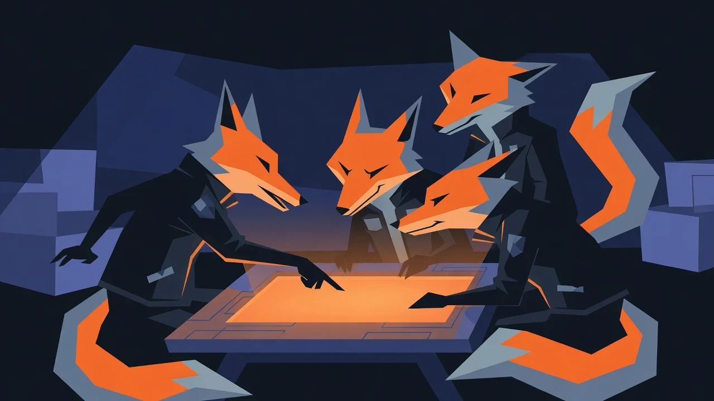

# Skulks and the Commons

## Skulks **\[designed]**

A Skulk is a crew of Foxes. Skulks hold treasuries (**AUM**), fight hostile takeovers over turf on the Street, and run seasonal campaigns against a named House: **the Big Score**, ending in a Street-wide Share-Out. Repeated Raids raise the Sheriff's attention; crews lie low in the Hollow or push their luck.

The social layer is not decoration. Trading, crew treasuries, and turf are where most player-to-player value transfer happens, and player-to-player transfer is what funds earning in this economy.

## The Commons **\[designed]**

Foxes and Skulks can donate Scrip or $ALPHA to the Commons in exchange for **standing**: reputation tiers, titles, regalia, crew prestige, leaderboard weight. Donations are periodically **Shared Out** as treasury-funded events open to everyone, such as newcomer boosts and tournament pools. Never as direct cashable transfers.

The Commons is the lore doing real economic work:

* It is a voluntary drain on whale wealth. Status demand rises with the size of the gift, so the largest fortunes compete on generosity, which is exactly where the economy wants surplus wealth to go.
* It gives the game a second long-term ladder beside net worth. *Rich* is one leaderboard; *beloved* is another.
* It is firewall-safe: donations never mint cashable value, and standing is non-transferable.

## The Share-Out

The treasury's spending arm, made diegetic: event budgets, prize pools, and newcomer support, funded by captured sinks and Commons donations, distributed by published rule. Fiscal policy dressed as folklore, and disclosed as both.
