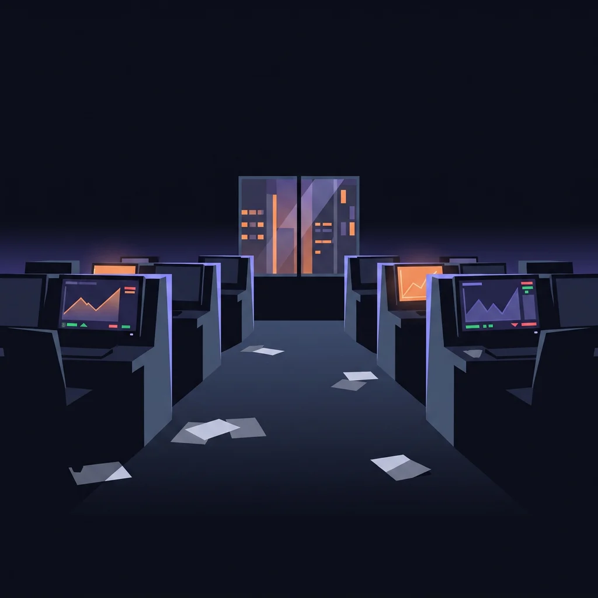

# The Street

The Street is owned by the Houses: bloated, slow, connected institutions that have rigged the flow. You're an outlaw trader. Too small to matter, too fast to catch. Run with a crew, raid the Houses, and share out the take.

The world is a 24/7 trading floor, neon terminal-noir meets old-school open-outcry culture. You are not a criminal being hunted for wrongdoing; you're the folk-hero competitor the market's giants can't out-trade. Failure is a bad Call, or getting **Nicked** by the Sheriff. Sporting stakes, not moral ones.

## The districts

| District | What happens there |
| --- | --- |
| The Floor | Gigs: honest work, reliable pay |
| Options Alley | Calls against the market and other players |
| The Pit | Where Raids on the Houses are run |
| The Dark Pool | The quiet end of the market |
| The Vault | The Houses' treasure, and the target |
| After Hours | The endgame district; the Street never closes |
| The Hollow | The crews' hideout quarter |

## Who you meet

* **The Houses**: fictional mega-funds. Raid targets, never named after or styled like real firms.
* **The Sheriff**: the Street's enforcer. A failed Raid gets you Nicked and sitting out a cooldown. An antagonist referee, not proof you're a felon.
* **Foxes**: everyone like you.
* **Skulks**: crews of Foxes. The real collective noun for foxes, and the closest thing the Street has to family. See [Skulks and the Commons](skulks-and-commons.md).

The tone rule the whole game is written to: every line should read as sporting defiance ("the Houses never saw it coming"), not criminality ("we broke in").
